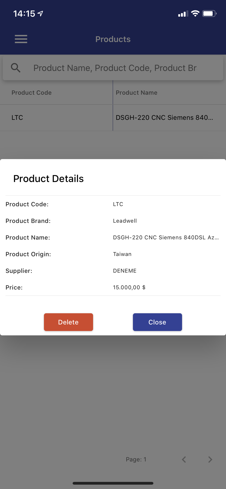
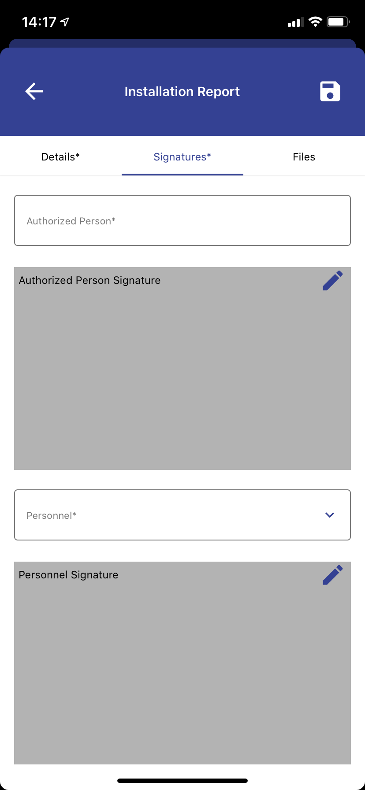

# CRM - Mobile
_Click [CRM - Web] to see the web version._
# _About_
> The application is created for a specific customer as a freelance project by me. Powered by [React Native] and [React Native Paper] for mobile application, [Node.js] and [Firebase] for backend. I am planning to add [MongoDB] support in the future.

## _Features_
- Users only see the tabs in the drawer that they have access to.
- Add bank account information to create pro forma invoices.
- List products, add and list spare parts and keep track of the stock.
- Add customer and supplier information.
- Create customer meetings - for sales team -.
- Create product, spare part and service proposals.
- Keep track of product and spare part sales. 
- Create service and installation reports.
- Keep track of warranty information of sold products.
- Send proposals, service and installation report to customer as email.

### _Drawer_

### _Login_

### _Product Details_

### _Customer_

### _Product Proposal_

### _Meeting_

### _Product Sale_

### _Installation Report_ 

### _Actions_

   [React Native]: <https://reactnative.dev>
   [Node.js]: <https://nodejs.org>
   [MongoDB]: <https://www.mongodb.com>
   [Express.js]: <https://expressjs.com>
   [React Native Paper]: <https://reactnativepaper.com>
   [Firebase]: <https://firebase.google.com>
   [Crm - Web]: <https://github.com/HakanKOCAK/CRM-Web>
